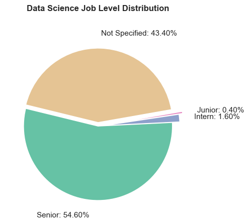
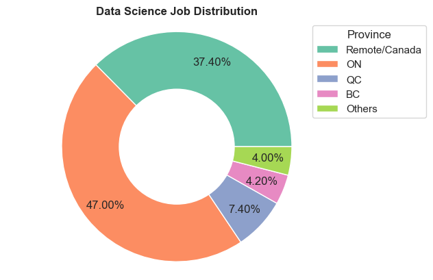
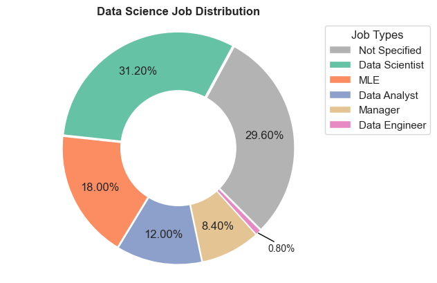

# Data Scientist in Canada: Project Overview 
* Created a tool that estimates data science salaries (asymmetric MAE ~ $ 8K) to help data scientists negotiate their income when they get a job, and built a client facing API using Flask 
* Scraped over 500 job postings in Canada from glassdoor using python and selenium
* Engineered features from the text of each job description to quantify the value companies put on python, excel, aws, and spark. 
* Optimized Linear, Lasso, Ridge, and Random Forest Regressors using GridsearchCV to reach the best model. 
* ON-GOING: data scientist job description generator

## Development
This project is managed using Poetry. To install Poetry, please refer to the [documentation](https://python-poetry.org/docs/#installation).
```bash
# install dependencies
poetry install

# activate the environment
poetry shell
```


## Web Scraping
`data/data.py` scraped 500 job postings from glassdoor.com using `data/glassdoor_scraper.py` and saved results to `data/glassdoor_jobs.csv`. With each job, we got the following:
*	Job title
*	Salary Estimate
*	Job Description
*	Ratings
*	Company 
*	Location
*	Company Size
*	Company Founded Year
*	Type of Ownership 
*	Industry
*	Sector
*	Revenue
* ...

## Data Preprocessing
After scraping the data, `data/data_preprocess.py` preprocess the raw data with `data/parse_info.py` and save to `data/data_processed.csv`.

## Explorary Data Analysis (EDA)
`data/data_analysis.ipynb` conducted EDA. Below are a few highlights. 





## Data Scientist Salary Estimation

`model.ipynb` built and evaluated several machine learning models to predict the average salary for data scientist jobs.

Percentages are first converted to float values. Mean imputation is implemented to handle the missing values for these features, as there are not too many of them.

Four different models are evaluated with a customized asymmetric loss function: **Linear Regression**, **Lasso Regression**, **Ridge Regression**, and **Random Forest**. The objective of the customized loss function is to impose a higher penalty when the prediction falls below the ground truth value. This approach aims to potentially dissuade users from making further requests.

### Model performance
The Random Forest model far outperformed the other approaches on the test and validation sets. 
*	**Random Forest** : asymmetric MAE = 7.95
*	**Lasso Regression**: asymmetric MAE = 10.08
*	**Ridge Regression**: asymmetric MAE = 10.25

## Productionization 
`FlaskAPI` contains a flask API endpoint that was hosted on a local webserver. The API endpoint  takes in a request with a csv file of features (`FlaskAPI/test_input.csv`) and a model (`FlaskAPI/models`) and returns an estimated salary. 

To run locally:
```bash
cd FlaskAPI

# start the APP
gunicorn --bind 0.0.0.0:8080 wsgi:application -w 1

# go to a new terminal in ./FlaskAPI
# predict with python
python request.py 
# predict with curl
curl -X GET http://0.0.0.0:8080/predict -H "Content-Type: application/json" -d '{"input":"test_input.csv", "mdl": "models/rf_mae_f1_est30.pkl"}'
```

## Acknowledgement
*	**Scraper Github:** https://github.com/arapfaik/scraping-glassdoor-selenium  
*	**Scraper Article:** https://towardsdatascience.com/selenium-tutorial-scraping-glassdoor-com-in-10-minutes-3d0915c6d905  
*	**Flask Productionization:** https://towardsdatascience.com/productionize-a-machine-learning-model-with-flask-and-heroku-8201260503d2
*	**YouTube Project Walk-Through:** https://www.youtube.com/playlist?list=PL2zq7klxX5ASFejJj80ob9ZAnBHdz5O1t

